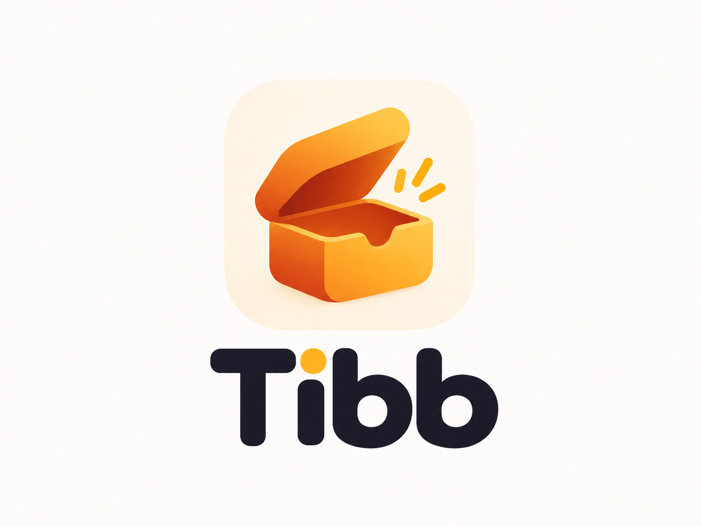

<p align="center"></p>

# Tibb

**A private inbox you message yourself.**

Tibb keeps the ease of messaging yourself, gives it boxes you own, and reaches your computer over your Wi-Fi without ever touching a cloud.

<p align="center">
  <iframe
    width="560"
    height="315"
    src="https://www.youtube.com/embed/oOoNGBXb0Vs"
    title="Tibb Demo"
    frameborder="0"
    allow="accelerometer; autoplay; clipboard-write; encrypted-media; gyroscope; picture-in-picture"
    allowfullscreen>
  </iframe>
</p>

- **No account, no server, no cloud.** Everything lives on your phone.

- **Boxes.** Personal, Work, Receipts. Each one has its own thread, emoji and color.

- **Tibb Bridge.** Open a web address on your laptop, type the 6-digit code shown on your phone, and drag files in. The phone itself serves the page over your Wi-Fi.

- **Locked boxes.** Behind your fingerprint (or Face ID). Their contents aren't shown, searched or sent to your computer until you unlock them.

- **WhatsApp import.** Bring your years of self-chat over.

- **Export everything, always free.** One file, optionally encrypted with AES-256-GCM and an Argon2id key derived from your password.

Built for the RevenueCat Shipaton 2026 (Next Gen Award). Flutter; Android is the primary tested target, and iOS is supported.

---

## Free vs Pro

| | Free | Tibb Pro |
|---|---|---|
| Text and links, search, pins, notes, archive | ✓ | ✓ |
| Export / import, WhatsApp **text** import | ✓ | ✓ |
| Photos, videos, files, voice memos | | ✓ |
| More than one box | | ✓ |
| Locked boxes (fingerprint / Face ID) | | ✓ |
| Tibb Bridge (your computer) | | ✓ |
| WhatsApp **media** import | | ✓ |

Pro is sold as a **lifetime** purchase or a **yearly** subscription through RevenueCat.

If Pro ends, you keep everything. You can still open every item and export for free. Only *creating* new Pro items pauses.

---

## Run it on an Android phone

This works from Windows, macOS or Linux, with no Mac and no paid developer account.

1. **Install the tools.**

   - [Flutter 3.27+](https://docs.flutter.dev/get-started/install)
   - [Android Studio](https://developer.android.com/studio), which brings the Android SDK
   - Run `flutter doctor` and fix anything it marks red, especially Android licenses: `flutter doctor --android-licenses`.

2. **Generate the platform projects.** From the repo root, run:

   ```bash
   dart run tool/setup.dart
   ```

   This runs `flutter create` around `lib/`, fetches packages and applies Tibb's settings:

   - **Android:** microphone, fingerprint and network permissions, the "Tibb" app name, the adaptive launcher icon, minSdk 24, and a `FragmentActivity` for fingerprint unlock;
   - **iOS:** the permission strings, if you ever build for iPhone later.

3. **Add your RevenueCat key.** Put your Test Store key into `env.json` (see below). This file is git-ignored.

4. **Prepare the phone.**

   - Go to Settings → About phone and tap **Build number** 7 times to enable Developer options.
   - Turn on **USB debugging** in Developer options.
   - Plug the phone in and accept the prompt on the phone.

5. **Build to the phone.**

   ```bash
   flutter run --dart-define-from-file=env.json
   ```

   Want an APK to install without a cable? Run `flutter build apk --dart-define-from-file=env.json`. The file lands in `build/app/outputs/flutter-apk/app-release.apk`; copy it to the phone and open it.

Without `env.json`, the app runs normally in the free tier. The paywall then says purchases aren't set up in this build.

**If the build fails:**

- **"requires Android NDK 27…":** add `ndkVersion = "27.0.12077973"` inside `android { }` in `android/app/build.gradle.kts`.
- **A Gradle or Kotlin version error:** run `flutter upgrade`, delete the `android/` folder, and run the setup again.

iPhone builds are also supported by the code. They need a Mac with Xcode: run the same setup on the Mac, open `ios/Runner.xcworkspace`, pick your Personal Team under Signing, and `flutter run`.

### RevenueCat Test Store setup (about 5 minutes)

The Test Store lets you make real purchase flows without App Store Connect. It needs purchases_flutter 9.8.0 or newer, which is pinned.

1. At [app.revenuecat.com](https://app.revenuecat.com), create a project and add a **Test Store** app. Copy its key, which starts with `test_`.

2. **Products:** create `tibb_pro_lifetime` (non-consumable) and `tibb_pro_yearly` (1-year subscription).

3. **Entitlement:** create `pro` and attach both products.

4. **Offering:** create `default` and mark it current. Add two packages:

   - `$rc_lifetime` with the lifetime product;
   - `$rc_annual` with the yearly product.

5. Put the key in `env.json`:

   ```json
   { "RC_API_KEY": "test_…" }
   ```

**Never ship a build with a `test_` key.** For Google Play or the App Store, replace it with that platform's public SDK key.

How Tibb uses RevenueCat (all of it in `lib/features/paywall/`):

- The paywall is custom, not a RevenueCat dashboard template. It reads `offerings.current`, so prices always come from the store.
- It opens with a line specific to the feature that triggered it. There are seven triggers:
  - Bridge, a second box, media, voice, lock and WhatsApp media;
  - a one-time soft prompt after 15 saves.
- Lifetime is pre-selected.
- Cancelling is never treated as an error.
- Restore is always visible.
- Settings → Tibb Pro shows your plan and renewal date, with a store management link.

---

## Try Tibb Bridge

1. On the phone, tap the laptop icon in the top bar.

2. On a computer on the **same Wi-Fi**, open the address shown (for example `http://192.168.1.4:8080`).

3. Type the 6-digit code shown on the phone.

4. From the computer:

   - drop files anywhere (with progress and cancel), or click **Send files**;
   - paste text anywhere to send it to the phone's clipboard card; paste files to save them;
   - hover an item to copy, download, pin or archive it; click photos and videos to view them large;
   - press `/` to search across boxes, `Ctrl/⌘ + Enter` to save what you typed;
   - **Import from WhatsApp**: drop an exported chat `.zip`; the phone reads it, you confirm the date order, and it imports with progress.

**Android:** Bridge keeps running while Tibb is minimized (a foreground service with a "Stop" button in the notification). The phone notifies you about real events only: "Saved from Chrome on Windows", "Clipboard from your computer". **iPhone:** keep Tibb open on screen; Tibb keeps the screen awake while Bridge runs, and asks once for Local Network access.

If there's no shared Wi-Fi, turn on the phone's hotspot and join it from the laptop.

Working on the web page without a phone:

```bash
node tool/bridge_mock/server.js        # http://localhost:8787, code 123456
python3 tool/bridge_mock/e2e.py        # Playwright walk-through (light/dark, 1360/900/600 px)
```

---

## WhatsApp import

1. In WhatsApp, open your self-chat.

2. Export it:

   - **Android:** tap ⋮ → More → Export chat → Include media, and save the file to your phone.
   - **iPhone:** tap the name at the top → Export Chat → Attach Media → Save to Files.

3. Bring it into Tibb, whichever is easiest:

   - **Android:** share the export straight to Tibb from WhatsApp's share sheet;
   - **any phone:** Settings (or the ⋯ menu) → Import from WhatsApp → pick the `.zip` (or `.txt`);
   - **computer:** in Tibb Bridge, click Import from WhatsApp and drop the `.zip`.

The parser handles iPhone and Android formats, 12-hour and 24-hour clocks, and day-first or month-first dates. When the file can't tell which (every day ≤ 12), Tibb shows sample messages and asks you to confirm Day/Month or Month/Day. Importing the same export twice skips what's already there.

## Share into Tibb (Android)

Tibb appears in Android's share sheet for text, links, photos, videos, audio, PDFs and any file, one or many at a time. A small sheet shows what arrived and which box it goes to; tap **Save** and you're back in the app you came from. Locked boxes never prompt for biometrics during a share. This is implemented natively in `MainActivity.kt` (no plugin); shared files are streamed into Tibb's cache, then into the content-hash store.

---

## Architecture (short version — see [docs/ARCHITECTURE.md](docs/ARCHITECTURE.md))

```text
lib/
  core/        models, SQLite + FTS5, append-only change log, content-hash blob store, repository
  design/      tokens, theme (light + dark), icons, shared components
  features/    thread, boxes, search, archive, items, voice, locked, bridge,
               paywall, export_import, whatsapp_import, settings

assets/bridge/ the web page the phone serves (vanilla JS, no external requests)
```

- **Change log.** Every edit is an append-only event, and the tables are derived from it. That's why import is safe to repeat, and why sync can be added later without migrating data.
- **One write path.** Items saved from the computer go through the same repository call as items saved on the phone.
- **Streaming files.** Media streams to disk while being hashed with SHA-256. Bridge uploads and downloads never load files into memory.

## Tests

```bash
flutter test
```

There are four test files:

- `test/whatsapp_parser_test.dart`;
- `test/tar_and_crypto_test.dart` covers the archive format, encryption round-trip, wrong password and truncation;
- `test/library_test.dart` covers the repository, search, undo, idempotent events, and export → import → re-import.

`library_test.dart` needs a host SQLite with FTS5:

- macOS has one built in;
- on Linux, install `libsqlite3-dev`;
- on Windows, place `sqlite3.dll` on your PATH.

## Known limitations

These are honest and also tracked in [PROJECT_STATE.md](PROJECT_STATE.md).

- **Bridge is plain HTTP on your LAN.** It's protected by a single-use code, one session at a time and a 32-byte token, but the traffic is not TLS-encrypted.
- **iPhone Bridge needs Tibb in the foreground.** Android keeps it alive with a foreground service; some very aggressive battery savers may still need Tibb exempted.
- **Share into Tibb is Android-only.** The iOS Share Extension (a separate Xcode target with an App Group) is a stretch goal and isn't built. On iPhone, use the + button, Bridge or WhatsApp import.
- **Notifications are Android-only** (native, no plugin). On iPhone, arrivals show as in-app toasts, which fits the "keep Tibb open" rule.
- **No cloud sync yet.** The change-log design is ready for it.

## License

[AGPL-3.0](LICENSE). You can use, study and modify Tibb. If you run a modified version for others, you must share your source.